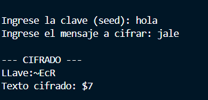
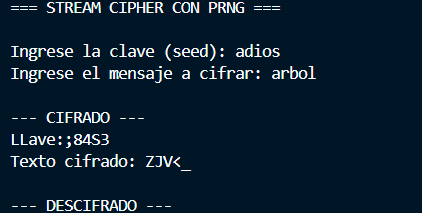
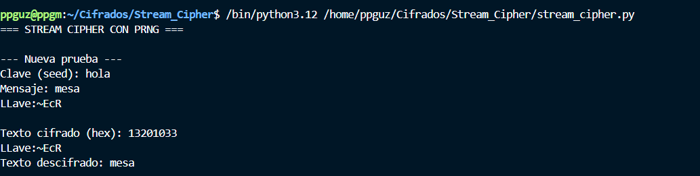
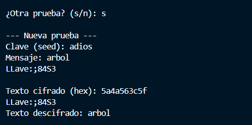
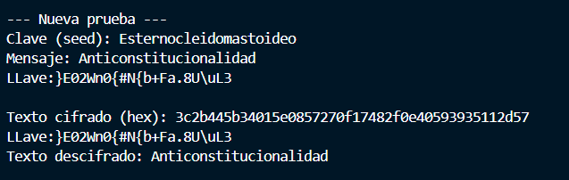

# Stream Chipher ejercicio

## 2.1 Variación de la Clave (5 puntos) o ¿Qué sucede cuando cambia la clave utilizada para generar el keystream? Demuestre con un ejemplo concreto.

Cuando cambiamos la clave para generar el keystream vemos que se generan diferentes keystream, sin embargo si usamos la misma clave 2 veces siempre vamos a generar el mismo keystream

## 2.2 Reutilización del Keystream (5 puntos) o ¿Qué riesgos de seguridad existen si reutiliza el mismo keystream para cifrar dos mensajes diferentes? Implemente un ejemplo que demuestre esta vulnerabilidad. o Sugerencia: Cifre dos mensajes con la misma clave y analice qué información puede extraer un atacante que intercepte ambos textos cifrados.

Para entender la vulnerabilidad que se genera al usar 2 veces el mismo keystream para 2 mensajes vamos a usar un poco de álgebra booleana.

Sabemos que: $Plain1 XOR Key = Cipher1$ y $Plain2 XOR Key = Cipher2$

Entonces $Cipher1 XOR Cipher2 = (Plain1 XOR Key) XOR (Plain2 XOR Key)$

Ahora recordemos la tabla XOR

| A | B | A XOR B |
|---|---|---------|
| 0 | 0 |    0    |
| 0 | 1 |    1    |
| 1 | 0 |    1    |
| 1 | 1 |    0    |

Vemos que si ambos terminos son iguales, entonces el resultado final de XOR será 0. Entonces en nuestra ecuación queda esto: 

$Plain1 XOR Plain2 XOR 0$ y agrupando obtenemos $(Plain1 XOR Plain2) XOR 0$ y vemos que si uno de los terminos de la operación es 0 y el otro es 1, entonces el resultado es 1, podemos afirmar entonces que $Cipher1 XOR Cipher2 = Plain1 XOR Plain2$

En base a eso el atacante puede ir probando distintos mensajes originales para despejar la ecuación y hallar los mensajes verdaderos. 

Referencia: http://www.crypto-it.net/eng/attacks/two-time-pad.html

## 2.3 Longitud del Keystream (5 puntos) o ¿Cómo afecta la longitud del keystream a la seguridad del cifrado? Considere tanto keystreams más cortos como más largos que el mensaje.

Un keystream más largo es más seguro pues nos asegura que cada byte se cifra con otra byte diferente del keystream y esto nos genera un one-time-pad que es bastante seguro. Si un keystream es más corto puede afectar la seguridad del mensaje pues se pueden generar patrones que los atacantes pueden descubirir. 

## 2.4 Consideraciones Prácticas (5 puntos) o ¿Qué consideraciones debe tener al generar un keystream en un entorno de producción real? Mencione al menos 3 aspectos críticos.

- No usar el mismo keystream para 2 mensajes: ya vimos que hacerlo puede generar varias vulnerabilidades por lo que en un entorno de producción real siempre debemos asegurarnos de generar keystreams diferentes para que no se generen estas vulnerabilidades. 

- Establecer un límite para el keystream: generar keystreams muy grandes puede necesitar una mayor capacidad de procesamiento para generarlo y para usarlo para cifrar mensajes por lo que debemos establecer un límite para la longitud máxima de un keystream. 

- Asegurar de que el nonce vaya cambiando en cada mensaje: no cambiarlo hace que se genere el mismo keystream y esto genera vulnerabilidades. 

## 3.1 Ejemplos

### Ejemplo 1

### 3.2 Pruebas unitarias

Puede verlas en 

